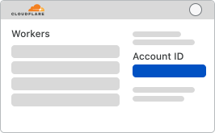
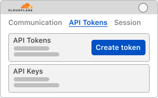

# Scaffolding for Telegram Bot with Mini App running in CloudFlare

## Introduction

This package is batteries-included package for running [Telegram Bots](https://core.telegram.org/bots) and [Telegram Mini Apps](https://core.telegram.org/bots/webapps) on [CloudFlare Workers Platform](https://workers.cloudflare.com/).

🚅 Fork to running Telegram bot with MiniApp in 5 minutes.

Uses:

* 🔧 Cloudflare Workers for running backend
* 📊 Cloudflare D1 for storing data and querying with SQL
* ⚛️ React built with Vite for frontend
* ✅ GitHub Actions and Wrangler for local running and deployment

## Deploying

The solution is fully deployable with GitHub Actions included with the repo. All you need to do is create a Cloudflare account and a Telegram Bot.

Fork the repository, then go to Settings > Secrets and add the following secrets:

* `CF_API_TOKEN` - Cloudflare API token with permissions to create Workers, D1 databases and Pages
* `CF_ACCOUNT_ID` - Cloudflare account ID
* `TELEGRAM_BOT_TOKEN` - Telegram Bot token

### Getting the values for secrets



Go to [CloudFlare Workers Page](https://dash.cloudflare.com/?to=/:account/workers) and copy the account id from the right sidebar. Note that if you have no workers yet, you'll need to create a worker before you can see the account id. Luckily, there's a button for a "Hello World" worker right there. Once you've gotten the account id, set it in `CF_ACCOUNT_ID` secret.

While you're in that interface, you can also adjust the subdomain to your liking.



Go to [CloudFlare Dashboard](https://dash.cloudflare.com/profile/api-tokens) and create a token with the following permissions:

* `Account:Account Settings:Read`
* `Account:CloudFlare Pages:Edit`
* `Account:D1:Edit`
* `Account:User Details:Read`
* `Account:Workers Scripts:Edit`
* `User:Memberships:Read`
* `Zone:Workers Routes:Edit`

Once you've generated the token, set it in `CF_API_TOKEN` secret.

For getting a telegram token, go to [@BotFather](https://t.me/BotFather) and create a new bot with the `/newbot` command. Once you've created the bot, copy the token and set it in `TELEGRAM_BOT_TOKEN` secret.

### Running the GitHub Actions workflow

After you've set up the tokens go to Actions, accept the security prompt and run the `Deploy` workflow. After the workflow is finished, the bot will be ready to go. The workflow will give you the URL to use for your mini-app.

### Setting up the mini-app

To add the mini-app you'll need to go back to [@BotFather](https://t.me/BotFather) and send the `/newapp` command. For some reason, an image is mandatory on this step, you can use a [placeholder](https://placehold.co/640x360) in the beginning.

Also, it's recommended that you update the `wrangler.toml` file with your own database ID as instructed by the workflow.

## Running locally

To run the bot locally, you'll need to have [Node.js](https://nodejs.org/en/download/) and [Microsoft DevTunnel](https://learn.microsoft.com/azure/developer/dev-tunnels/get-started?tabs=windows).

Then you need to do three things:

* Run a local Worker server
* Run a local React server
* Run a tunnel for the React server so that it can be used as a Telegram Mini App

### React

For running a react server:

```bash
cd webapp
npm install
npm run dev
```

Remember the port it uses, I'll assume it's 5173.

### Tunnel

In a different terminal, set up the tunnel:

```bash
devtunnel user login
devtunnel create # note the tunnel ID
devtunnel port create -p 5173
```

Then you can start the tunnel as needed with `devtunnel host --allow-anonymous`.

For the mini-app setup you need the URL that uses 443 port, it will look something like `https://aaaaaaaa-5173.euw.devtunnels.ms`.

This approach allows you to keep the name of the tunnel the same, so you don't need to update the bot every time you restart the tunnel.

### Worker

Make sure that the you've deployed at least once and set your own database id in the `wrangler.toml` file.

Then create a `.dev.vars` file using `.dev.vars.example` as a template and fill in the values. If you set `TELEGRAM_USE_TEST_API` to true you'll be able to use the bot in the [Telegram test environment](https://core.telegram.org/bots/webapps#testing-mini-apps), otherwise you'll be connected to production. Keep in mind that tokens between the environments are different.

Do an `npm install` and initialize the database with `npx wrangler d1 execute DB --file .\init.sql --local`.

Now you are ready to run the worker with `npx wrangler dev`. The worker will be waiting for you at <http://localhost:8787/>.

### Processing telegram messages when running locally

When you are running locally, the worker is intentionally not set up to process messages automatically. Every time you feel your code is ready, you can open <http://localhost:8787/updateTelegramMessages> to process one more batch of messages.

If you do want to process messages automatically in local environment, you can write a trivial script to poke this URL along the lines of:

```bash
while true; do
    curl http://localhost:8787/updateTelegramMessages
    sleep 3
done
```

## Code information

The backend code is a CloudFlare Worker. Start with `index.js` to get a general idea of how it works.

We export `telegram.js` for working with telegram, `db.js` for working with the database and `cryptoUtils.js` for cryptography.

There are no dependencies except for `itty-router`, which makes the whole affair blazing fast.

For database we use CloudFlare D1, which is a version of SQLite. We initialize it with `init.sql` file.

The frontend code is a React app built with Vite. The entry point is `webapp/src/main.jsx`. This is mostly a standard React app, except it uses excellent [@vkruglikov/react-telegram-web-app](https://github.com/vkruglikov/react-telegram-web-app) to wrap around the telegram mini app API.

The frontend code can be replaced with anything that can be served as a static website. The only requirement is that the built code after `npm run build` is in the `webapp/dist` folder.

## Security features

All the needed checks are done:

* The bot checks the signatures of the webhook requests
* The bot checks the signatures of the Mini-app requests and validates the user
* The bot checks the token of initialization request sent during deployment
* CORS between the frontend and the backend is locked down to specifically used domains

## Sample bot

You can try out the bot at [@group_meetup_bot](https://t.me/group_meetup_bot).
